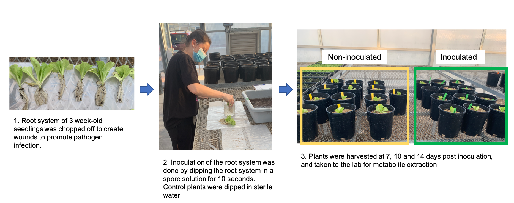
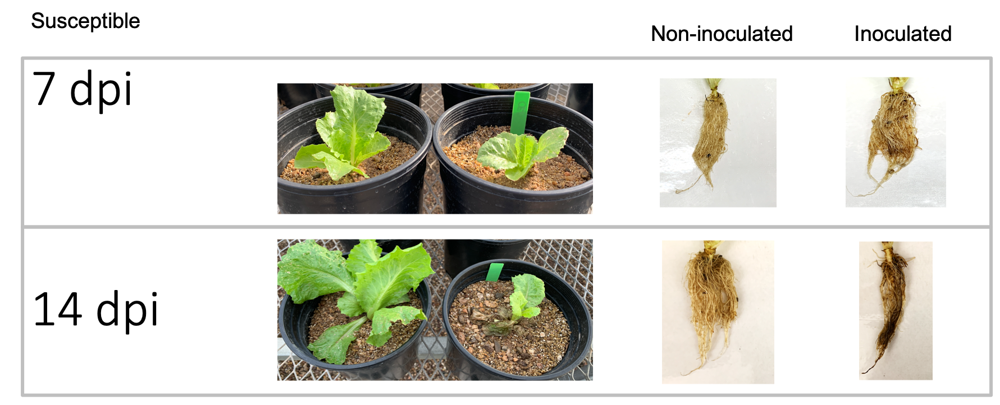
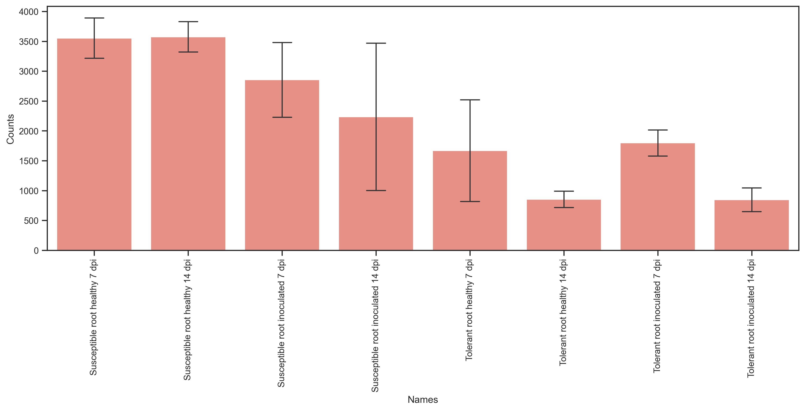
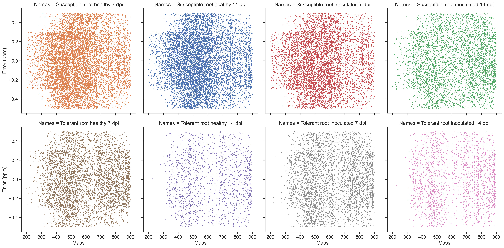
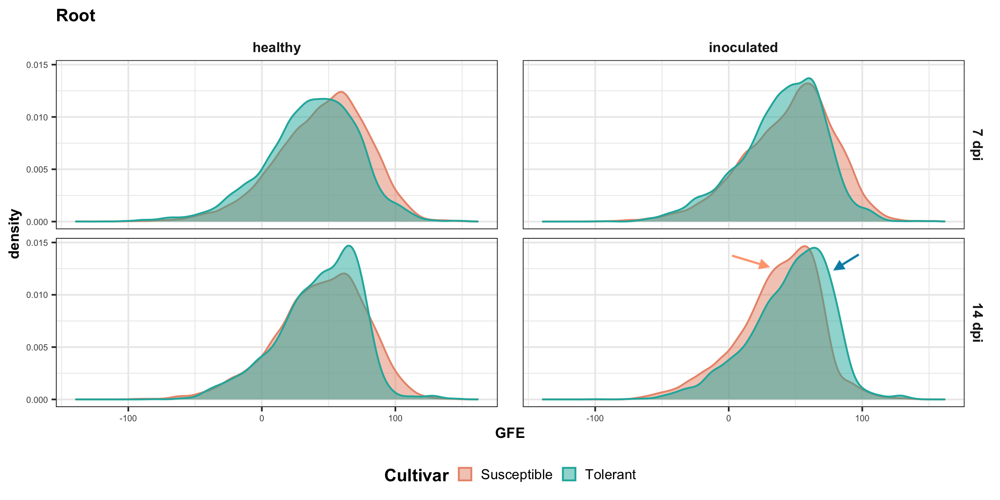
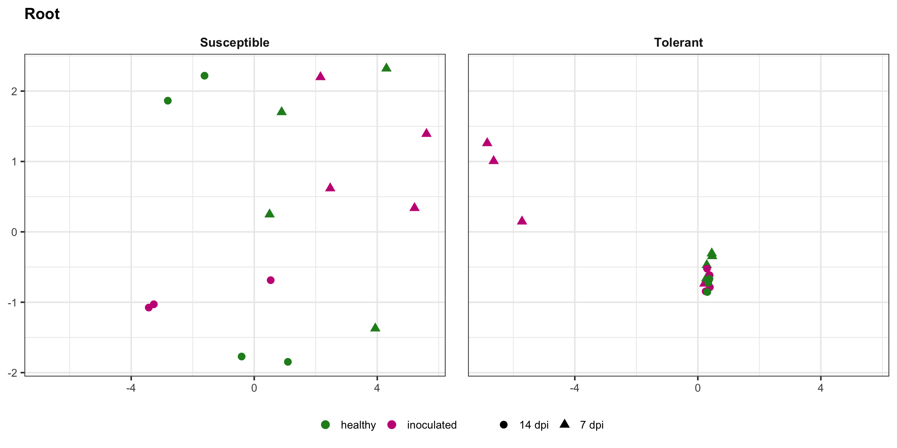

# Fusarium wilt of lettuce

MetaboDirect pipeline/notebooks for my Fusarium wilt of Lettuce project.

# Content

- [1 - Project overview](#1---project-overview)
- [2 - Main objectives of direct infusion](#2---main-objectives-of-direct-infusion)
- [3 - How to run the pipeline](#3---how-to-run-the-pipeline)
- [4 - Main findings and future directions](#4---main-findings-and-future-directions)
- [References](#references)

---
## 1 - Project overview

Fusarium wilt (FW) of lettuce, caused by the fungus *Fusarium oxysporum* f. sp. *lactucae* race 1, is an important pathogen of lettuce (*Lactuca sativa* L.) in the southwest, which is the largest US production region of iceberg and romaine lettuce.

This pathogen is seed- and soilborne, and infects lettuce plants by penetrating through secondary roots and moving into the vascular system. Belowground symptoms include internal discoloration of the tap root and collapse of the root system, which negatively affects the uptake of water and nutrients. As the disease progresses, aboveground lettuce plants show yellowing, stunting, leaf necrosis, and death of plants resulting in unmarketable lettuce. The key management strategy of FW of lettuce is the adoption of cultivars with good genetic resistance or tolerance to the pathogen.

Metabolomics is a fast-emerging technology in life sciences research that remains relatively untapped in agriculture and breeding programs. Fourier transform Ion Cyclotron Resonance mass spectrometry (FTICR-MS) by direct infusion in untargeted approach is a high-throughput metabolomics technique in which samples are injected directly into the ionization source of the mass spectrometer. This technique allows samples to be fully processed within minutes. The ultra-high mass accuracy and resolving power of FTICR instruments allows for molecular formula assignment on thousands of peaks in each mass spectrum.

We are developing this project in collaboration with Dr. Barry Pryor (University of Arizona). Our main goal was to demonstrate the capabilities of direct infusion FTICR-MS in agriculture by profiling the metabolome of two healthy and infected lettuce cultivars, a susceptible and a tolerant cultivars.

The image below shows the experiment setup, and shows me at work!

Disease development in the susceptible cultivar. At 14 days post inoculation, plant stunting and decline were evident. In addition, root system is severely compromised (root rot).

---
## 2 - Main objectives of direct infusion

Untargeted direct infusion (DI) mass spectrometry is a metabolomics technique for bulk metabolite characterization because of the **high-throughput** capabilities. FTICR instruments are ultra-high resolution and mass accuracy, which allows for the detection of a greater number of metabolites with similar masses compared to other lower resolution instruments.

DI techniques are used for **bulk characterization** of compounds, and comparing the metabolite fingerprinting across samples. DI is not reliable for structural characterization of a few compounds.

In our untargeted DI studies, peaks detected in the mass spectrometer are assignned a candidate molecular formula by softwares such as Formularity (Tolić et al., 2017). Subsequently, we calculate several molecular ratios and indices that assign a candidate class (e.g., carbohydrate, lipid, lignin) to these compounds, which then allows us to make comparisons across samples.

We face great challenges in the identification of compounds in DI by FTICR approaches, particularly in environmental studies and studies of non-model organisms because a lot of these metabolites are "known unknowns and unknowns unknowns" (Peisl et al., 2018).

---
## 3 - How to run the pipeline

1. After samples were scanned in FTICR instrument in negative mode, spectrum for each sample was exported to `.xml`. In very simplistic terms, these data contain a list of numbers, which are the mass over charge ratio (m/z) of each metabolite detected by the mass spectrometer.

2. Formularity was used to assign a molecular formula to these m/z values, and we normally only consider the following elements: CHONSP. Formularity is a GUI open-source software that is only available for Windows OS, which makes reproducibility and automation difficult. The output data from Formularity is a table that contains the m/z, molecular formula, error in ppm of the molecular formula assignment, and the raw intensity values across samples. This is the datafile used in this analysis pipeline.

3. **Pipeline starts here**

    1. Jupyter notebook [1_Preprocessing](./1_Preprocessing.ipynb).

        The output from Formularity is a file called `Report.csv`. It's important to work with the output file from Formularity as is.

        These are the steps in the preprocessing:

            - Filter predicted formulas with 13C
            - Optional: filter m/z between a m/z range
            - Error range correction, between -0.5 and 0.5 ppm
            - Calculate soil organic C indices and class of compounds
            - Calculate a summary output of elemental and class composition per sample
            - Calculate a summary output of median and weighted mean of indices per sample
            - Make matrix for downstream analyses

    2. Jupyter notebook [2_Diagnostics](./2_Diagnostics.ipynb)

        It's important to assess data quality at this point. Here, I demonstrate how to assess the mean number of molecular formula across samples, and the error range with and without applying error correction.

        
        *Average count of molecular count assignment across samples*

        
        *Mean (corrected) error distribution of across samples*

        I expected to see a more even molecular formula assignment across samples because. This can come chomp my derrière later...

         This can reveal issues with extraction protocol, instrument biases, data acquisition problems like accumulation time in the instrument.

    3. R markdown file for [Exploratory analysis](./3_Exploratory.Rmd)

        One of the calculations performed was Gibbs free energy (ΔG°C-ox in kJ/mol of carbon, i.e., GFE), which is an indicator of thermodynamic bioavailableavailability of compounds. Lower GFE values indicate more bioavailable compounds, e. g., sugars and carbohydrates, and higher GFE values indicate more recalcitrant compounds, e. g., lignin (LaRowe & Van Cappellen, 2011).

        
        **GFE distribution on roots. Slight shift in GFE in inoculated plants at 14 dpi in that susceptible cultivars shows a slight lower GFE compared to the tolerant cultivar. A higher GFE in the tolerant cultivar could be an indication of higher lignin production, which is a known marker for disease resistance of pathogens that colonize the vasculature.**

    4. R markdown file for [Multivariate statistics](./4_Statistics.Rmd)

        In this pipeline, I ran two multivariate analyses: NMDS and PERMANOVA using the vegan R package (Oksanen et al., 2019).

        
        **NMDS is an ordination technique that is performed on a dissimilarity matrix, and does not have any underlying assumptions on the data like linear relationship**

        In the NMDS, I ran all root samples together, but I decided to facet the plot to make visualizations easier. The separation observed in the NMDS is not great. I am still investigating why almost all tolerant lettuce samples are clumped. Looking at the susceptible, there seems to be a slight trend in trend (14 dpi towards the left, and 7 dpi towards the right).

        |               | Df  | F. Model |  R2   | Pr(>F) |  
        | :-------      | :-- | :------- | :---- | :----- |  
        | Treatment     |  1  |   1.512  | 0.043 |  0.182 |   
        | Time          |  1  |   2.708  | 0.077 |  0.003 \*\*|
        | Cultivar      |  1  |   4.731  | 0.135 |  0.001 \*\*\*|    

        I then ran a PERMANOVA to find out which factors are driving the most these differences among samples. Time and cultivar were significant factors driving approximately 7.7% and 13.5% of the differences observes in the dataset, respectively.

**Preliminary conclusions**
DI technique has many limitations in regards to the assumptions of metabolites it is able to detect, meaning that we are limited to a molecular formula assignment, and there is not much biological information we can draw from there (i.e., pathways).

The PERMANOVA analysis picked up significant differences between cultivars and time better than the separation by NMDS. This demonstrate the potential of DI for metabolic fingerprinting of different cultivars and disease development overtime.

---
## 4 - Main findings and future directions

This was our first experiment with plants, and there are many things to improve here including:

1. Improve our mass spectrometer method. We had a method that works well for negative mode accquisition of soil organic matter, and perhaps that is not the most appropriate method for plant metabolites.

2. These samples were scanned a few weeks apart (the holidays were in the middle... yes, postdocs take vacations too), and we suspect there were significant variances and/or inconsistencies with the instrument during that time.

3. For future experiments, we have to adapt the current root inoculation protocol to not chop half of the root system. In the susceptible cultivar, the root system collapse was very severe at 14 dpi, and yielded less than 0.5 g of root system for plant extraction, which is a problem.

4. Assumptions about metabolite pathways are very limited in DI experiments. We did a preliminary LC-MS/MS run, and it looks more promising than DI in determining differences amongst cultivars.

---
## References

Oksanen, J. et al. (2019). vegan: Community Ecology Package (R package version 2.5-6) [Computer software]. https://CRAN.R-project.org/package=vegan

LaRowe, D. E., & Van Cappellen, P. (2011). Degradation of natural organic matter: A thermodynamic analysis. Geochimica et Cosmochimica Acta, 75(8), 2030–2042. https://doi.org/10.1016/j.gca.2011.01.020

Peisl, B. Y. L., Schymanski, E. L., & Wilmes, P. (2018). Dark matter in host-microbiome metabolomics: Tackling the unknowns–A review. Analytica Chimica Acta, 1037, 13–27. https://doi.org/10.1016/j.aca.2017.12.034

Tolić, N., Liu, Y., Liyu, A., Shen, Y., Tfaily, M. M., Kujawinski, E. B., … Hess, N. J. (2017). Formularity: Software for automated formula assignment of natural and other organic matter from ultrahigh‐resolution mass spectra. Analytical Chemistry, 89, 12659– 12665.
